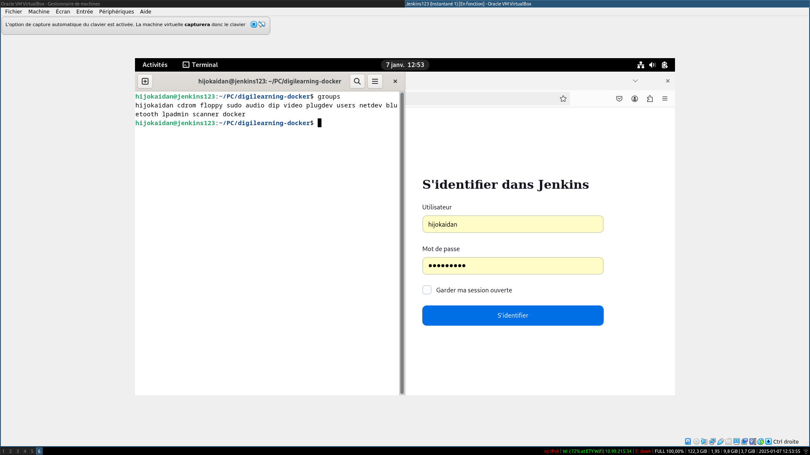

# Documentation de déploiement V1

## 1. Mise en place du serveur Jenkins.

La première étape consiste à mettre en place une VM Debian 12 pour pouvoir accueillir le serveur Jenkins.

Ensuite, il faut ajouter l'utilisateur principal dans la liste des sudoers, récupérer les packets nécessaires
à l 'installation de docker, et ajouter le groupe "docker" à l'utilisateur principal.



Une fois ceci fait, il suffit alors d'aller récupérer l'image docker de Jenkins, faire une redirection de port,
configurer le mot de passe de l'administrateur, et récupérer les plugins nécessaires.

Pour cela, on va dans `Administrer Jenkins > Plugins`, on récupère les plugins pour Sonarqube et JaCoCo, et on redémarre
Jenkins.

Ensuite, on ajoute l'outil `Maven 3.9.9` à Jenkins, pour pouvoir l'utiliser dans la pipeline.


Enfin, dernière étape de la mise en place de notre serveur vient après avoir mis en place le serveur Sonarqube :
on doit ajouter les credentials pour se connecter à Sonarqube, ainsi que l'URL du serveur Sonarqube


## 2. Mise en place du serveur Sonarqube.

Sur un système d'exploitation Debian contenant Docker dans le même réseau que le serveur Jenkins, on lance le docker Sonarqube.

Une fois le nouveau mot de passe ajouté, on peut maintenant configurer un nouveau projet local, dont le nom et la clé serviront 
dans le script présent dans le Jenkinsfile pour récupérer des données à propos du build.


## 3. Mise en place du build.

### 3.1 Ajout du repo.

Pour mettre en place la pipeline, j'ai décidé d'utiliser un repo public appelé "Nodzcrypt-learning", une de mes applications Java.
J'ai donc ajouté l'URL du repo et mis en place un token d'authentification sur github.


### 3.2 Travail préparatoire dans le Jenkinsfile.

Pour pouvoir effectuer mes actions, j'avais besoin de définir l'outil Maven dans le script, ainsi que le repo à récupérer

```groovy
pipeline {
    agent any
    tools {
        maven 'Maven 3.9.9'
    }
    stages {
        // Récupération du repo distant.
        stage('Checkout') {
            steps {
                git 'https://github.com/Cyber-cicco/n0dzCrypt-Learning.git'
            }
        }
        // Les différents éléments de ma pipeline
    }
}
```


### 3.3 Ajout des tests et du build

La première étape la plus facile consiste à ajouter les deux éléments ne demandant que de configurer maven.

Dans le repo, il y a un fichier de test unitaire pour des utilitaires permettant de manipuler des chaines de caractères.

```java
package fr.diginamic.digilearning.utils;

import org.junit.jupiter.api.Test;

import java.util.Optional;

import static org.junit.jupiter.api.Assertions.*;

class StringUtilsTest {

    @Test
    void isDigits() {
        assertTrue(StringUtils.isDigits("123345"));
        assertTrue(StringUtils.isDigits("1"));
        assertFalse(StringUtils.isDigits(""));
        assertFalse(StringUtils.isDigits("12 3"));
    }

    @Test
    void getIndexOfCounterIfPresent() {
        assertEquals(4, StringUtils.getIndexOfCounterIfPresent("test_1").get());
        assertEquals(5, StringUtils.getIndexOfCounterIfPresent("test__1").get());
        assertEquals(5, StringUtils.getIndexOfCounterIfPresent("test__11111111").get());
        assertEquals(Optional.empty(), StringUtils.getIndexOfCounterIfPresent("test-1"));
    }

}
```

Ces tests utilisent le framework de test proposé par Spring Boot, ainsi que junit. Pour cela, il suffisait de rajouter l'entrée suivante au pom.xml : 


```xml
        <dependency>
            <groupId>org.springframework.boot</groupId>
            <artifactId>spring-boot-starter-test</artifactId>
            <scope>test</scope>
        </dependency>
```

Enfin, il fallait simplement lancer les tests via maven dans la pipeline en ajoutant ce stage : 

```groovy
        stage('Test') {
            steps {
                sh 'mvn test'
            }
        }
```

Pour le build, il suffisait simplement d'ajouter ce stage à la pipeline:

```groovy
        stage('Build') {
            steps {
                sh 'mvn clean package -DskipTests'
            }
        }
```


### 3.4 Ajout de Sonarqube

Après avoir créé l'installation Sonarqube ayant pour identifiant 'SonarQ', et après avoir créer sur Sonarqube un projet local avec pour nom et clé "Digilearning", on pouvait simplement ajouter le stage suivant pour lancer le scan Sonarqube via Maven:

```groovy
        stage('SonarQube Analysis') {
            steps {
                 script {
                     def mvnHome = tool 'Maven 3.9.9' 
                     withSonarQubeEnv('SonarQ') {
                         sh "${mvnHome}/bin/mvn clean verify sonar:sonar -Dsonar.projectKey='Digilearning' -Dsonar.projectName='Digilearning'"
                     }
                 }
             }
        }
```

On obtiens alors ce résultat:


### 3.5 Ajout de JaCoCo.

On ajoute le plugin JaCoCo à la fois dans Jenkins (comme vu dans la mise en place du serveur) et dans le pom.xml comme ceci : 

 
```xml
            <plugin>
                <groupId>org.jacoco</groupId>
                <artifactId>jacoco-maven-plugin</artifactId>
                <version>0.8.10</version>
                <executions>
                    <execution>
                        <goals>
                            <goal>prepare-agent</goal>
                        </goals>
                    </execution>
                    <execution>
                        <id>report</id>
                        <phase>verify</phase>
                        <goals>
                            <goal>report</goal>
                        </goals>
                    </execution>
                </executions>
            </plugin>
```

Ensuite, on ajoute un stage exécutant la commande maven de vérification:

```groovy
        stage('Code Coverage') {
            steps {
                sh 'mvn verify'
            }
        }
```

Ainsi que la commande permettant de récupérer le rapport HTML de JaCoCo sous forme d'archive du build:

```groovy
        stage('Archive Coverage Report') {
            steps {
                // Archive the JaCoCo coverage report
                archiveArtifacts artifacts: 'target/site/jacoco/*.html', allowEmptyArchive: true
            }
        }
```

Et voici le résultat:


### 3.6 Déploiement

Ce n'est pas directement la pipeline qui s'occupe du déploiement : c'est le serveur vers lequel le repo va être push qui va déployer le serveur. Pour cela, on peut simplement ajouter ce script à la pipeline:


```groovy
        stage('Deploy') {
            steps {
                git 'remote add destination git@10.99.215.34:/PC/n0dzCrypt-Learning'
                git 'push -u destination master'
            }
        }
```

L'adresse IP doit correspondre à un serveur ayant un port SSH ouvert et correctement configuré pour recevoir la clé privée. 

### 3.7 Version finale

Voici donc la version finale du Jenkinsfile

```groovy
pipeline {
    agent any
    tools {
        maven 'Maven 3.9.9'
    }
    stages {
        stage('Checkout') {
            steps {
                git 'https://github.com/Cyber-cicco/n0dzCrypt-Learning.git'
            }
        }
        stage('Test') {
            steps {
                sh 'mvn test'
            }
        }
        stage('Code Coverage') {
            steps {
                sh 'mvn verify'
            }
        }
        stage('Archive Coverage Report') {
            steps {
                // Archive the JaCoCo coverage report
                archiveArtifacts artifacts: 'target/site/jacoco/*.html', allowEmptyArchive: true
            }
        }
        stage('Build') {
            steps {
                sh 'mvn clean package -DskipTests'
            }
        }
        stage('SonarQube Analysis') {
            steps {
                 script {
                     def mvnHome = tool 'Maven 3.9.9' 
                     withSonarQubeEnv('SonarQ') {
                         sh "${mvnHome}/bin/mvn clean verify sonar:sonar -Dsonar.projectKey='Digilearning' -Dsonar.projectName='Digilearning'"
                     }
                 }
             }
        }
        //TODO: faire en sorte que ce stage ne se déclenche que si les deux dernière étapes ont fonctionnées.
        //TODO: faire en sorte de créer une pipeline qui permet d'attendre que le conteneur soit build avant de reup pour éviter un délai entre les deux déploiements.
        stage('Deploy') {
            steps {
                git 'remote add destination git@10.99.215.34:/home/hijokaidan/PC/Digilearning/n0dzCrypt-Learning.git'
                git 'push -u destination master'
            }
        }
    }
}
```

## 4. Configuration du serveur de déploiement.

Le serveur de déploiement doit être un Linux possédant git et ayant configuré git pour en faire un serveur.

Pour cela, on commence, par générer un couple de clés privée / publique.

Ensuite, sur le serveur , il faut générer un utilisateur nommé git, ajouter la clé publique que l'on vient de générer dans le fichier "authorized_keys" de son dossier .ssh, et ajouter le clé privée dans Jenkins. Pour cela, on installe le plugin "Publish over SSH", et on ajoute la clé privée dans la configuration de Jenkins.


Il faut ensuite configurer git pour en faire un serveur.

Une fois cela fait, il faut configurer un hook pour lancer un script de déploiement chaque fois qu'un push est reçu sur la branche main.

L'idée est donc de créer un DockerFile et un docker-compose.yml mettant en place le stack nécessaire au déploiement de l'application, comme ceci : 

Le DockerFile:

```dockerfile
#
# Build
#
FROM maven:3-eclipse-temurin-17-alpine AS build
RUN mkdir -p /workspace
WORKDIR /workspace
COPY pom.xml /workspace
COPY src /workspace/src
RUN mvn -B -f pom.xml clean package -DskipTests

#
# Package
#
FROM azul/zulu-openjdk-alpine:17-latest
WORKDIR /digi-learning
COPY --from=build /workspace/target/*.jar app.jar
EXPOSE 8090
ENTRYPOINT ["java","-jar","app.jar"]

```

Le docker-compose.yml:

```yaml
services:
    db:
        image: mariadb:latest
        restart: always
        environment:
            MARIADB_ROOT_PASSWORD: root
        ports:
            - 3306:3306
        volumes:
            - ./init-db:/docker-entrypoint-initdb.d

    phpmyadmin:
        image: phpmyadmin
        restart: always
        ports:
            - 8083:80
        depends_on:
            - db
    
    app:
        image: digilearning
        ports:
            - 8090:8090
        environment:
            SPRING_DATASOURCE_URL: jdbc:mariadb://db:3306/sid
            SPRING_DATASOURCE_USERNAME: root
            SPRING_DATASOURCE_PASSWORD: root
        volumes:
            - ./ressources:/digi-learning/ressources
```

Ce docker-compose sera trigger par le web-hook présent dans le dossier .git du repository.

Pour cela, on va créer un fichier .sh exécutable au chemin suivant `/home/hijokaidan/PC/Digilearning/.git/hooks/post-receive`

```bash
#!/bin/bash

GIT_DIR="/home/hijokaidan/PC/digi-learning.git"
WORK_DIR="/home/hijokaidan/PC/digi-learning"
BRANCH="master"

while read oldrev newrev ref
do
    # only checking out the master (or whatever branch you would like to deploy)
    if [[ $ref = refs/heads/$BRANCH ]];
    then
        echo "Ref $ref received. Deploying ${BRANCH} branch to production..."
        cd "$WORK_DIR" || { echo "Failed to navigate to $WORK_DIR"; exit 1; }
        docker compose down
        docker stop digilearning || true 
        docker rm digilearning || true
        docker build -t digilearning .
        docker compose up
    else
        echo "Ref $ref received. Doing nothing: only the ${BRANCH} branch may be deployed on this server."
    fi
done
```

Ce script s'active sur chaque push reçu, et effectue les actions suivantes : 

 * Vérification du fait qu'il s'agisse d'un push sur la branche master
 * Stoppe les éléments lancés par le docker compose précédent
 * Supprime la version précédente du build de l'application
 * Rebuild l'application selon le docker file.
 * Relance le stack selon le docker-compose

Et permet donc de lancer la nouvelle application en production
