# Digilearing

## Qu'est-ce que Digilearing ?

Digilearning est la pateforme de e-learning de Diginamic. C'est ici que les formateurs peuvent mettre en ligne des cours. Ils peuvent téléverser des cours au format markdown, partager des pdfs, des exercices, et des vidéos d'explication pour les cours.

Coté stagiaire, c'est ici qu'il va pouvoir avoir accès aux cours e-learning de Diginamic. Il pourra en avoir imposé par sa formation, mais il pourra également y avoir accès en dehors des cours obligatoires. 

Il pourra également sur ce site discuter avec d'autres membres de la session, pourra prendre contact avec son responsable pédagogique, pourra poser des questions spécifiquement sur certains suejts et consulter les questions et réponses que d'autres apprenants ont pu apportés lors de la formation.

On peut également imaginer qu'une personne qui ne soit pas inscrite à Diginamic ait également accès à ce site pour consulter des cours d'introduction à la programmation.

## Pourquoi Digilearning ?

L'idée initiale vient d'un feedbackk que tout le monde m'a fait sur les journées de e-learning : linkedin learning, c'est vraiment très mauvais. Le fait que Diginamic soit dépendant de cela pour certaines journées de cours écorne l'image du centre de formation, qui pourtant se démarque en temps normal de la concurrence par la qualité des cours dispensés (d'après Eli finalement l'ENI c'est pas si bien que ça).

Ainsi, si ce feedback est donné par les élèves, ce n'est pas un membre de Diginamic ou Tecken qui fera la demande de création de cette application. Raison pour laquelle j'ai décidé de proposer cette idée. Nous n'aurons jamais une demande directe des clients de Diginamic, et pourtant, construire des applications pour eux est peut-être même plus important que d'en construire pour l'informatique interne de Diginamic.

En effet, si Diginamic et Tecken souhaitent pouvoir recruter / vendre leurs alternants, il est important que ces entreprises aient des moyens de prouver que ses élèves / alternants ont des compétences dans le développement web. Et rien de mieux que d'exposer ce travail au grand public pour prouver sa qualité. Si nous utilisons les alternants de Tecken simplement pour l'informatique interne de Diginamic, nous n'aurons aucun moyen d'exposer la qualité de l'enseignement reçu et des talents disponibles de l'entreprise. De plus, l'informatique interne étant externalisée à Ypareo, nous avons toute l'occasion de commencer à créer des sites pouvant servir de vitrine à Diginamic et Tecken. L'idée de pouvoir exposer quelques cours à tout le monde permettrait également à toute personne qui fait des recherches sur Diginamic d'avoir une idée du type de cours dispensé. On pourrait également demander aux personnes sans expérience dans le domaine de l'informatique de bien vouloir suivre ces cours avant de rentrer en formation.

Même les plateformes spécialisées dans le e-learning comme Studi, centre de formation auquel j'ai pu travaillé, souffrent d'une qualité de site assez mauvaise, avec un front en AngularJS qui doit être une horreur à maintenir, vu le nombre de bugs et d'inconsistances que l'on peut y rencontrer. Le marketing de Studi consiste donc en un démarchage relativement agressif sans montrer le produit auquel les élèves pourront avoir accès. Ici, le but serait de jouer carte sur table. On pourrait leur dire : "Voilà à quoi va ressembler la formation, et en plus ce site a été fait par des anciens élèves de Diginamic".

Permettre à Diginamic de pouvoir proposer un site internet de formation un niveau au dessus des autres, et potentiellement pouvoir mettre en libre accès quelques cours d'introduction à la programmation pour des personnes extérieures au centre de formation permettrait à Diginamic de se démarquer de la concurrence. Diginamic dispensant des cours de qualité, mais ayant surtout du mal à se faire reconnaitre, proposer ce genre de vitrine permettrait au centre de se faire reconnaitre.

Enfin, on pourrait imaginer, si les feedbacks sur le site et les cours en e-learning sont bons, dispenser des formations mettant une plus grande emphase sur le e-learning, on pourrait vendre les cours à des entreprises souhaitant former des développeurs sur des technologies particulières, vendre des cours à l'unité pour des personnes souhaitant se former personnellement, etc.

Le but de digi-learning est donc de créer un site non pas pour faciliter la gestion de l'informatique interne de Diginamic, mais pour servir d'interface avec ses clients, et aider à la croissance de l'entreprise en augmentant sa visibilité, en augmentant la qualité du produit délivré, et en diversifiant les prestations proposées sans avoir besoin de nouvelles mains d'oeuvre ou de se former sur de nouvelles technologies.

## Comment Digilearning ?

Voici une démonstration du fonctionnement de Digilearning

### Le login

En tant qu'apprenant, je commence par me connecter à mon compte sur cette page :

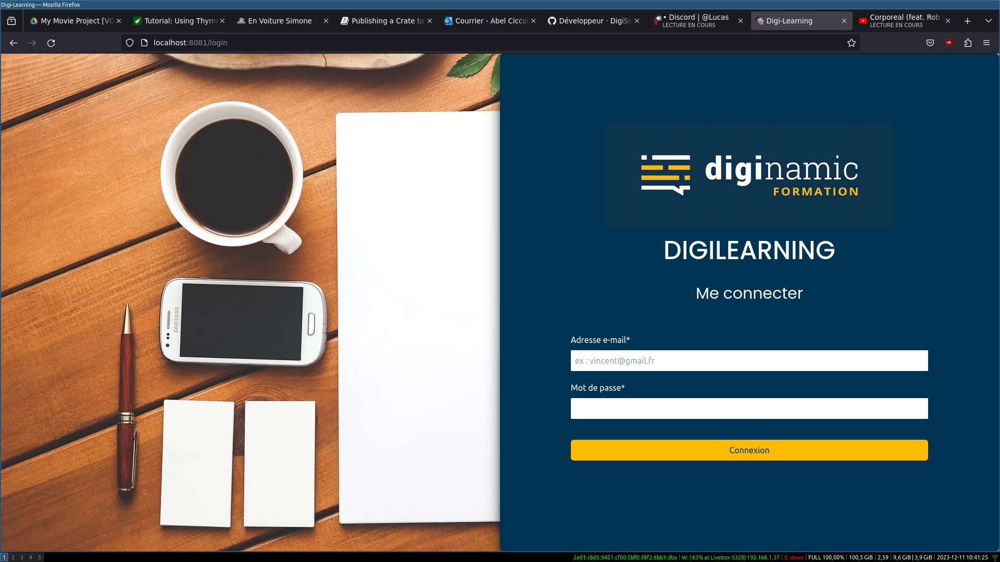

### Ma page d'accueil

Une fois connecté, je tombe sur une page d'accueil, avec une brève présentation du site, un rappel de mes cours prévus aujourd'hui, des cours que j'ai ajouté à mes favoris, et un lien rapide vers d'autres sections du site, dont mon agenda, ma messagerie et le forum des apprenants. A partir de la liste des cours du jours ou de mes favoris, je peux directement aller consulter ces cours en cliquant sur leur nom. Je peux également les marquer comme terminé avec la petite checkbox verte pour les cours du jours, ou retirer les cours de mes favoris avec la petit icône de marque page.

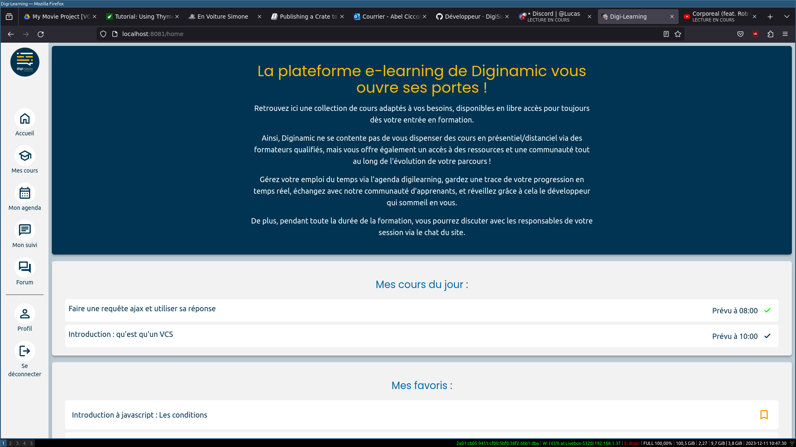

Mes cours du jours sont déterminés par l'un des points principaux de ce site: l'agenda

### Mon agenda

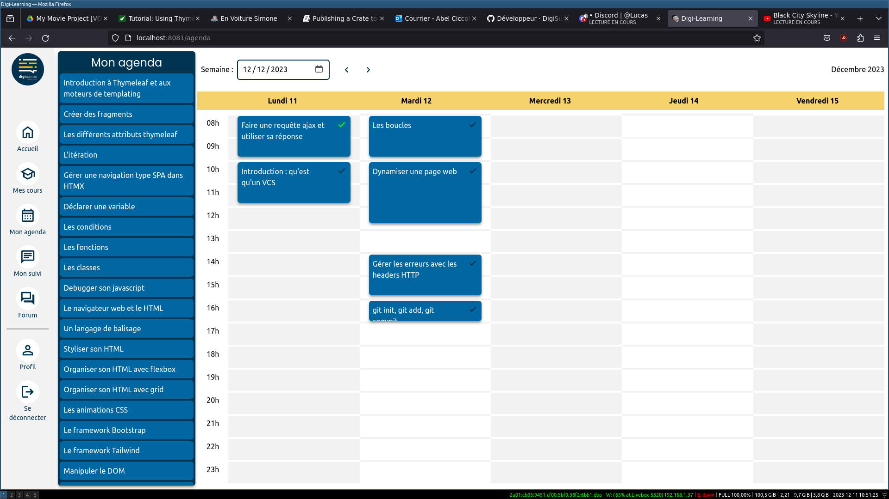

L'agenda me présente à gauche la liste des cours auxquelles j'ai accès. Pour l'instant ils sont triés d'une façon fixe et il est impossible de faire une recherche, mais un champ de recherche et la possibilité de faire différents tris sont à prévoir. 

Ces cours, je peux les glisser-déposer sur le calendrier à droite pour créer mon emploi du temps. Il est également prévu que des formateurs puissent glisser déposer certains cours sur l'emploi du temps des élèves. Ceux-ci ne seraient alors pas modifiable par les élèves.

Les cours ont tous une durée estimée, infulant sur la place qu'ils prennent sur le calendrier. Pour l'instant, pour des raisons de simplicité à produire un premier rendu, la durée est comptée en heures, et non en minutes.

Il est possible de marquer un cours comme terminé sur le calendrier grâce à la petite icone en haut à droit de chaque cours.

Il est possible de naviguer vers le cours en cliquant sur son nom.

Il est possible de changer la date prévue d'un cours, en le glissant d'une date à l'autre. Il est également possible de retirer un cours de son agenda en le passant du calendrier à la colonne de gauche.

### Mes cours

Les cours sont organisés selon différents modules et sous modules. Par défaut, une formation a plusieurs modules, un module a plusieurs sous-modules, un sous-module a plusieurs cours, et un cours a plusieurs chapitres et des exercices.

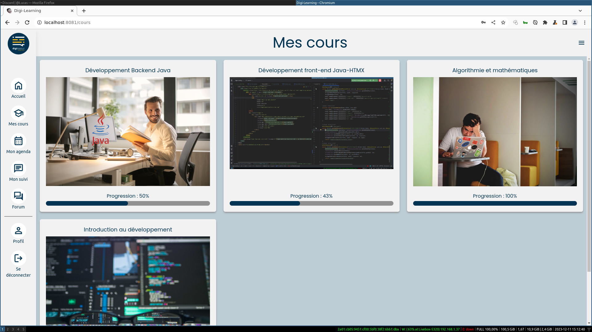
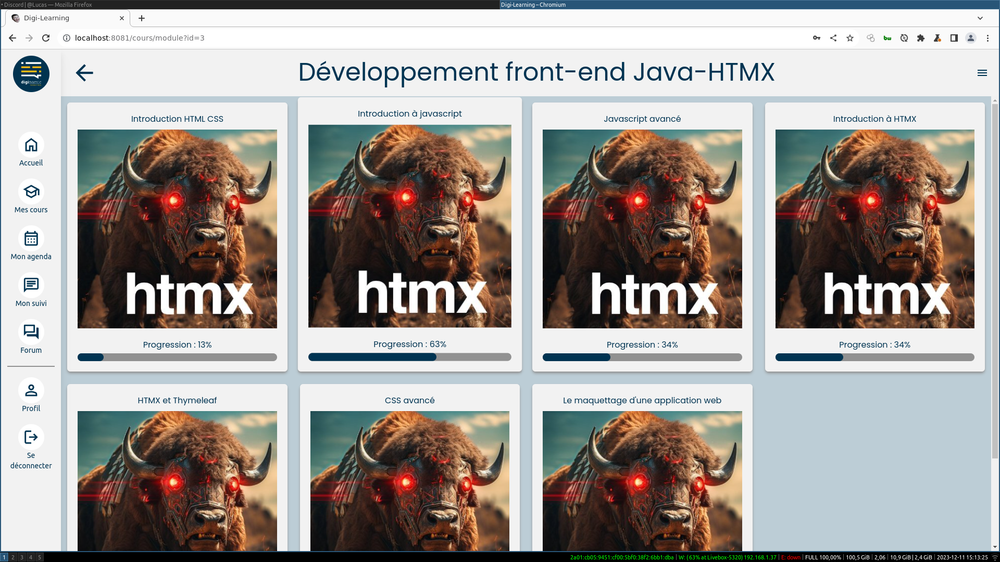
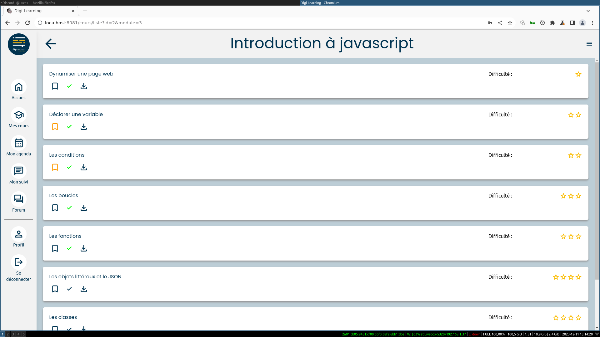

Sur ma liste de cours, je peux télécharger, marquer comme favoris ou marquer comme terminé chaque cours.

La visionneuse de cours propose tout d'abord un sommaire résumant tous les chapitres. A coté de cette visionneuse, on peut trouver une barre de navigation me permettant de me déplacer entre les chapitres. Je peux également ajouter un cours dans mes favoris ou le marquer comme terminé à partir de cet écran.

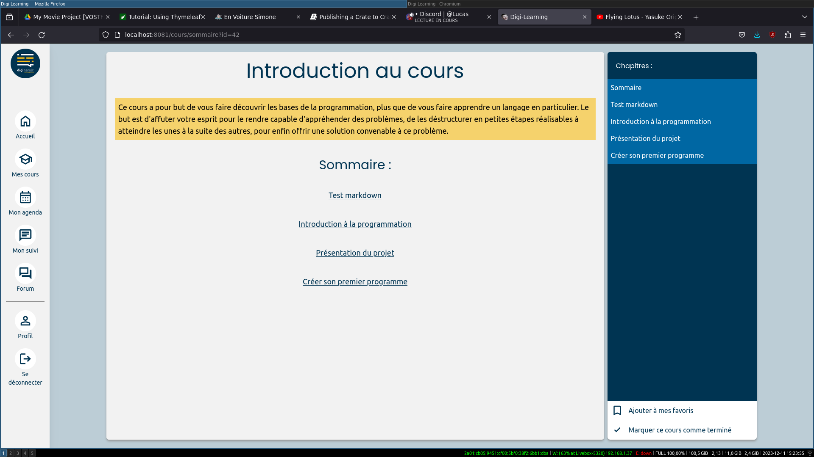

Lorsque l'on navigue sur un chapitre, le cours du chapitre est affiché au centre de l'écran.
A la fin du chapitre, il y a éventuellement un lien vers une vidéo d'explication pour ce cours.
A tout moment, je peux cliquer sur "Afficher / cacher les questions - réponses" en bas pour consulter les questions posées sur ce cours, proposer des réponses, et poser mes propres questions.

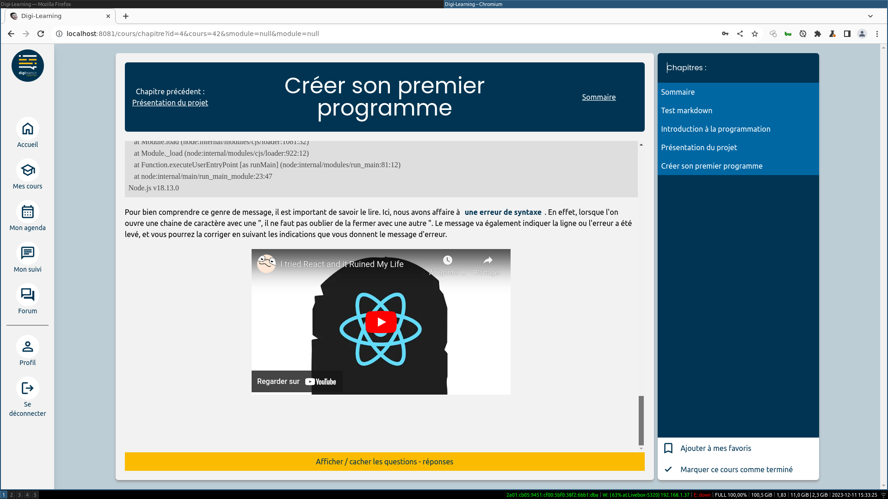
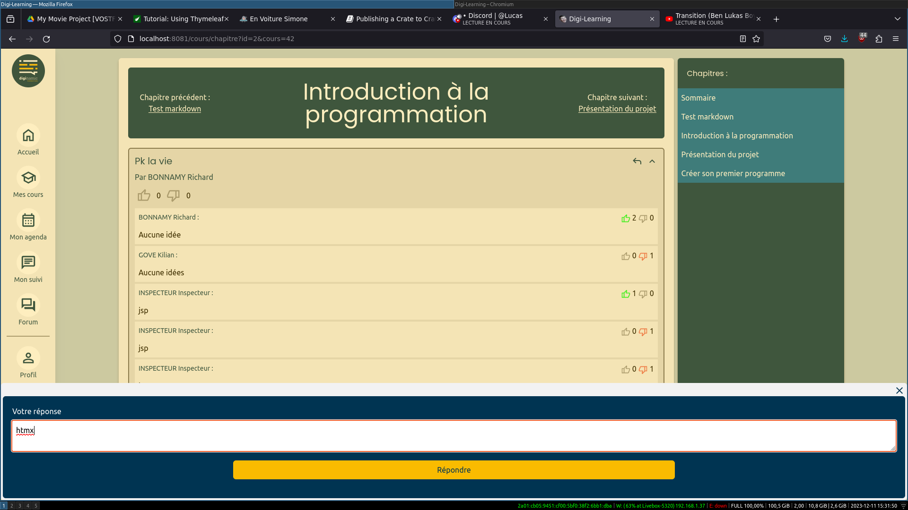

Il est également possible de like et dislike les différentes questions et réponses. Ce n'est pas encore implémenté, mais il pourrait être intéressant de trier les questions et réponses par popularité.

### Ma messagerie

Si ce n'est pas la partie la plus intéressante ni la plus obligatoire à implémenter, il y a également la possibilité de chater avec différents reponsables de la session, à savoir le reponsable administratif, le responsable pédagogique et les rooms master.

*note : cette partie n'est pas forcément la plus utile, je l'ai créée à l'origine pour tester les limites de HTMX. L'implémentation du back pour les messages est peut être problématique ou à retravailler*

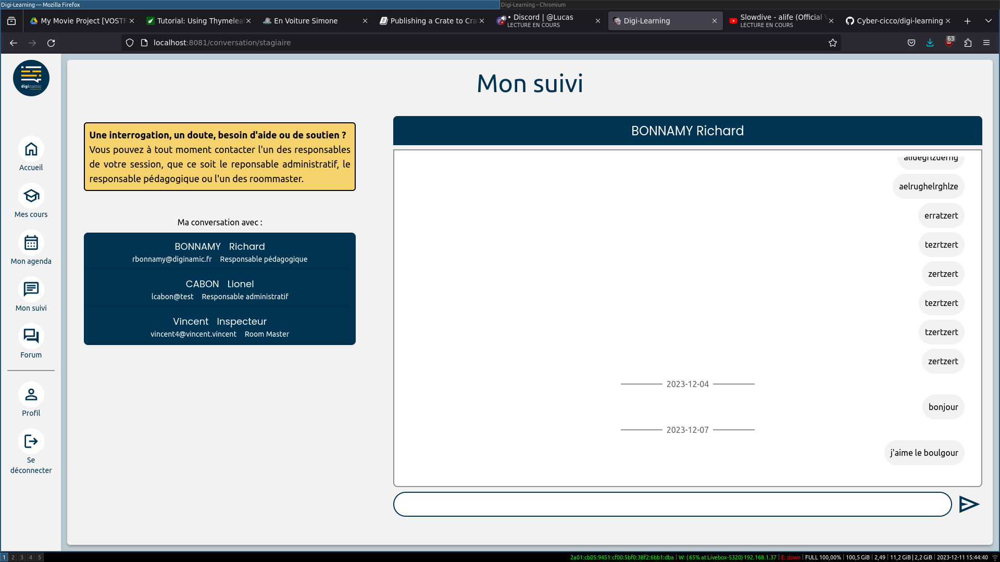

### Le forum des apprenants

Ici, je dispose de plusieurs salons, regroupés selon différents sujets. Je peux consulter des fils des discussion en rapport avec le thème du salon, répondre à ces discussions, et créer de nouveaux fils. Je n'ai accès qu'aux fils de discussion sur lesquels je suis whitelisté, ou non blacklistés pour les salons généraux.

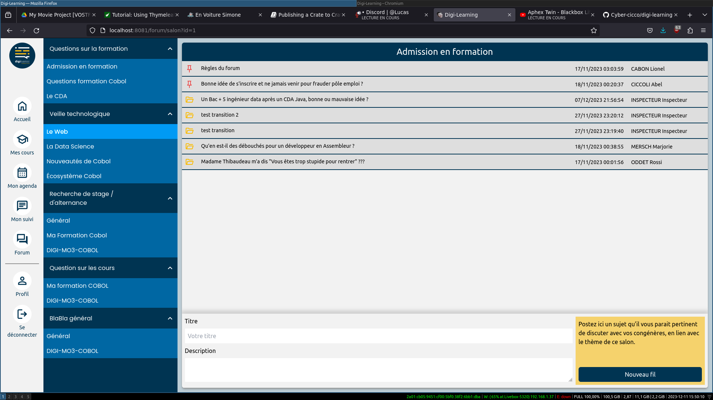
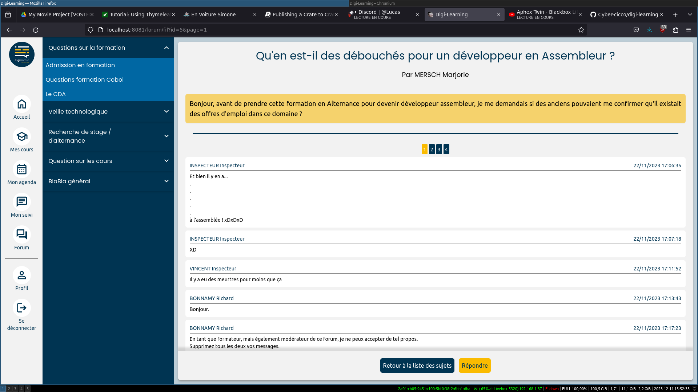

Certains fils de discussion peuvent être fermés, d'autres vont être épinglés.

### Mon profil

Enfin, je peux consulter différentes informations sur mon profil. Je peux y voir mes informations personnelles, des informations sur ma progression, et je peux me connecter sur les différents services proposés aux apprenants pour Diginamic, comme Digicap.

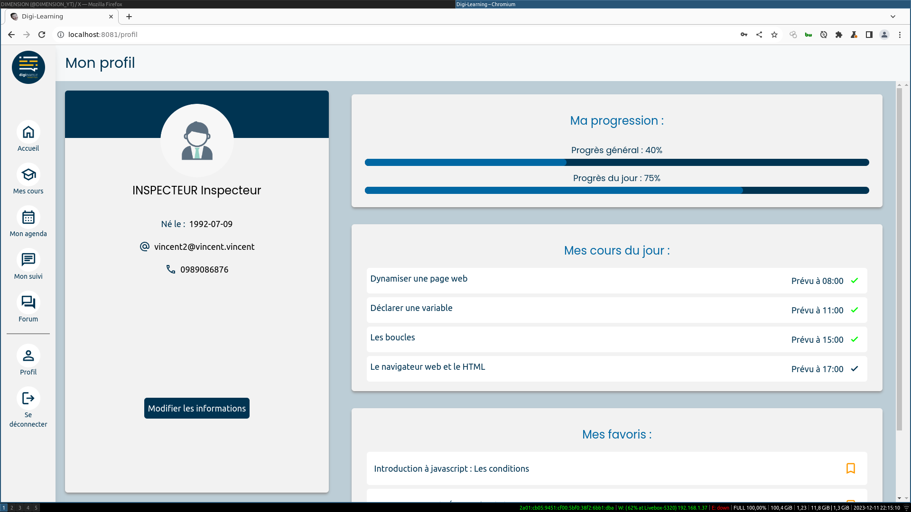

## Intégration de Digilearning au SI de Diginamic.

L'avantage de ce site est que l'on est pas obligé de le proposer tout de suite dans sa version finale. Il est possible de l'intégrer progressivement au SI de Diginamic, puis ensuite d'ouvrir les possiblités d'utilisation. L'idée serait la suivante:

- On déploie d'abord une V1 où le site n'est accessible que pour des personnes de Diginamic. On met en lignes quelques courts sur des certaines technologies généralistes (comme git, github, javascript, HTML, UML), on choisit une sessions d'anciens apprenants à qui l'on offre un accès illimité à ces cours en échange de feedback sur les différents bugs trouvés (Je sais par exemple que Arnold Wilk est un grand consommateur de formations en lignes et que cela pourrait l'intéresser). Pour la création de ces cours, on donnera l'accès à back office pour tous les formateurs et alternants de Diginamic / Tecken, et on pourra mettre une liste de cours à faire à disposition du personnel qui pourra s'en emparer sur l'espace de un ou deux mois. On ferait valider les cours par un coordinateur pédagogique.

- Une fois les bugs corrigés, et si le feedback est bon, on pourra tester sur une session le fait de proposer les cours de e-learning sur Digilearning. Cela permettra de tester l'application dans un contexte plus concret, et d'avoir des retours de personnes dans un contexte professionnel. Si jamais les utilisateurs sont satisfaits, et que les bugs constatés sont corrigés (ou qu'il n'y en a pas), on pourra commencer à généraliser à d'autres cours.

- A partir de là, on pourra commencer à intégrer les dernières fonctionnalités nécessaires au fait de pouvoir faire entrer l'application dans une nouvelle d'exploitation, où l'on laisserait des utilisateurs non connectés accéder à une page d'accueil esthétiquement travaillée et quelques cours gratuits. On pourrait alors commencer à envisager la création de session avec une plus grande part laissée au e-learning, le fait de vendre des cours à la carte pour des particuliers ou des entreprises, etc.

C'est-à-dire que l'application pourra être utile bien avant sa phase d'exploitation finale. Avant de pouvoir être utilisée pour vendre des cours ou de nouveaux types de formations, l'application pourra être utilisé pour l'informatique interne de Diginamic, pour avoir un endroit particulier où déposer les cours ou les TPs.
